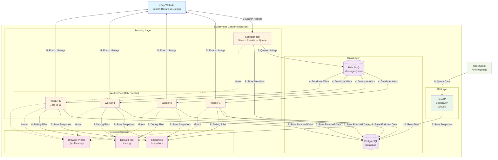

# Price Tracker Architecture

## System Overview

The Price Tracker uses a **parallel queue-based architecture** for high-performance eBay data collection and processing.

## Architecture Diagram



## Component Details

### 🗄️ **Data Layer**

#### PostgreSQL Database
- **Purpose**: Stores search metadata, enriched listings, and user data
- **Schema**: `price_tracker` schema with tables for searches, listings, and metadata
- **Persistence**: 8Gi persistent volume with MicroK8s hostpath storage
- **Access**: Internal cluster access via `postgres-service:5432`

#### RabbitMQ Message Queue
- **Purpose**: Distributes listing enrichment work across multiple workers
- **Queues**: 
  - `listing_enrichment` - Main work queue
  - `listing_enrichment_dlq` - Dead letter queue for failed messages
- **Features**: Message persistence, TTL (12 hours), retry logic
- **Access**: Internal cluster access via `rabbitmq-service:5672`

### 🌐 **API Layer**

#### FastAPI Search API
- **Purpose**: Provides REST API for querying collected data
- **Port**: NodePort 30080 (accessible from host)
- **Endpoints**: `/health`, `/docs`, `/searches`, `/listings`
- **Features**: Auto-generated OpenAPI docs, health checks

### 🔄 **Scraping Layer**

#### Collector Job
- **Purpose**: Scrapes eBay search results and queues listings for enrichment
- **Execution**: Kubernetes Job (suspended CronJob by default)
- **Process**:
  1. Navigate to eBay search results
  2. Extract listing metadata (title, price, URL)
  3. Store search metadata in PostgreSQL
  4. Queue individual listings in RabbitMQ
- **Configuration**: `SEARCH_TERM`, `MAX_PAGES`, `ENRICH_LIMIT=0`

#### Worker Jobs (16x Parallel)
- **Purpose**: Enrich individual listings with detailed data
- **Execution**: Kubernetes Job with 16 parallel workers
- **Process**:
  1. Consume listings from RabbitMQ queue
  2. Navigate to individual listing pages
  3. Extract detailed information (description, images, seller info)
  4. Handle bot detection and retry logic
  5. Save enriched data to PostgreSQL
  6. Save snapshots for debugging
- **Features**: 
  - Permanent failure handling (404, invalid URLs)
  - Temporary failure retry (network issues)
  - Browser profile persistence for bot detection avoidance

### 💾 **Persistent Storage**

#### Snapshots Directory
- **Purpose**: Store HTML snapshots of enriched listing pages
- **Path**: `/var/snap/microk8s/common/price-tracker/snapshots`
- **Usage**: Debugging, analysis, and data verification

#### Debug Directory
- **Purpose**: Store debug information and error snapshots
- **Path**: `/var/snap/microk8s/common/price-tracker/debug`
- **Usage**: Troubleshooting bot detection and extraction issues

#### Browser Profile
- **Purpose**: Maintain persistent browser session for bot detection avoidance
- **Path**: `/var/snap/microk8s/common/price-tracker/profile-ebay`
- **Usage**: Store cookies, history, and browser fingerprint data

## Data Flow

### 1. **Collection Phase**
```
eBay Search Results → Collector Job → PostgreSQL (metadata) + RabbitMQ (listings)
```

### 2. **Processing Phase**
```
RabbitMQ → 16x Worker Jobs → eBay Individual Listings
```

### 3. **Enrichment Phase**
```
Workers → Extract Detailed Data → PostgreSQL (enriched data) + Snapshots (debug)
```

### 4. **API Access Phase**
```
User → FastAPI → PostgreSQL → Response
```

## Performance Characteristics

- **Parallelization**: 16x concurrent listing enrichment
- **Throughput**: ~16 listings processed simultaneously
- **Scalability**: Worker count configurable via `WORKER_PARALLELISM`
- **Reliability**: Dead letter queue for failed messages
- **Persistence**: All data and messages persisted across restarts

## Security Features

- **No Hardcoded Secrets**: All credentials via Kubernetes secrets
- **Internal Communication**: Services communicate within cluster
- **Resource Limits**: Memory and CPU constraints on all pods
- **Non-root Containers**: Security contexts for all deployments
- **Network Policies**: ClusterIP services only

## Monitoring & Observability

- **Health Checks**: API health endpoint at `/health`
- **Logs**: Structured logging across all components
- **Queue Monitoring**: RabbitMQ management interface
- **Resource Monitoring**: Kubernetes resource usage tracking
- **Debug Capabilities**: HTML snapshots and debug files

## Deployment

All components are deployed via Kubernetes manifests:
- `k8s/api-deployment.yaml` - FastAPI application
- `k8s/rabbitmq-deployment.yaml` - Message queue
- `k8s/collector-job.yaml` - Search results collection
- `k8s/worker-job.yaml` - Parallel listing enrichment
- `k8s/postgres-values.yaml` - Database configuration

## Testing

- **Unit Tests**: 43 tests covering all components
- **Integration Tests**: End-to-end system testing
- **Mock Infrastructure**: Comprehensive mocking for external dependencies
- **Test Coverage**: All major code paths tested
