# Price Tracker Architecture Diagram

## System Architecture Overview

This diagram shows the parallel queue-based architecture of the Price Tracker system.

```mermaid
graph TB
    %% External Systems
    eBay[eBay Website<br/>Search Results & Listings]
    
    %% Kubernetes Cluster
    subgraph K8s["🚀 Kubernetes Cluster (MicroK8s)"]
        subgraph DataLayer["💾 Data Layer"]
            PostgreSQL[(PostgreSQL<br/>Database)]
            RabbitMQ[(RabbitMQ<br/>Message Queue)]
        end
        
        subgraph APILayer["🌐 API Layer"]
            FastAPI[FastAPI<br/>Search API<br/>:30080]
        end
        
        subgraph ScrapingLayer["🔄 Scraping Layer"]
            Collector[Collector Job<br/>Search Results → Queue]
            
            subgraph Workers["⚡ Worker Pool (16x Parallel)"]
                W1[Worker 1]
                W2[Worker 2]
                W3[Worker 3]
                WN[Worker N<br/>...up to 16]
            end
        end
        
        subgraph Storage["💾 Persistent Storage"]
            Snapshots[Snapshots<br/>/snapshots]
            Debug[Debug Files<br/>/debug]
            Profile[Browser Profile<br/>/profile-ebay]
        end
    end
    
    %% External Access
    User[👤 User/Client<br/>API Requests]
    
    %% Data Flow - Collection Phase
    eBay -->|1. Search Results| Collector
    Collector -->|2. Queue Listings| RabbitMQ
    Collector -->|3. Store Metadata| PostgreSQL
    
    %% Data Flow - Processing Phase
    RabbitMQ -->|4. Distribute Work| W1
    RabbitMQ -->|4. Distribute Work| W2
    RabbitMQ -->|4. Distribute Work| W3
    RabbitMQ -->|4. Distribute Work| WN
    
    %% Data Flow - Enrichment Phase
    W1 -->|5. Enrich Listings| eBay
    W2 -->|5. Enrich Listings| eBay
    W3 -->|5. Enrich Listings| eBay
    WN -->|5. Enrich Listings| eBay
    
    %% Data Flow - Storage Phase
    W1 -->|6. Save Enriched Data| PostgreSQL
    W2 -->|6. Save Enriched Data| PostgreSQL
    W3 -->|6. Save Enriched Data| PostgreSQL
    WN -->|6. Save Enriched Data| PostgreSQL
    
    W1 -->|7. Save Snapshots| Snapshots
    W2 -->|7. Save Snapshots| Snapshots
    W3 -->|7. Save Snapshots| Snapshots
    WN -->|7. Save Snapshots| Snapshots
    
    W1 -->|8. Debug Files| Debug
    W2 -->|8. Debug Files| Debug
    W3 -->|8. Debug Files| Debug
    WN -->|8. Debug Files| Debug
    
    %% Data Flow - API Access
    User -->|9. Query Data| FastAPI
    FastAPI -->|10. Read Data| PostgreSQL
    
    %% Storage Mounts
    Collector -.->|Mount| Profile
    W1 -.->|Mount| Profile
    W2 -.->|Mount| Profile
    W3 -.->|Mount| Profile
    WN -.->|Mount| Profile
    
    %% Styling
    classDef external fill:#e1f5fe,stroke:#01579b,stroke-width:2px
    classDef database fill:#f3e5f5,stroke:#4a148c,stroke-width:2px
    classDef api fill:#e8f5e8,stroke:#1b5e20,stroke-width:2px
    classDef scraper fill:#fff3e0,stroke:#e65100,stroke-width:2px
    classDef storage fill:#fce4ec,stroke:#880e4f,stroke-width:2px
    classDef user fill:#f1f8e9,stroke:#33691e,stroke-width:2px
    
    class eBay external
    class PostgreSQL,RabbitMQ database
    class FastAPI api
    class Collector,W1,W2,W3,WN scraper
    class Snapshots,Debug,Profile storage
    class User user
```

## Key Features

### 🚀 **High Performance**
- **16x Parallel Workers** for concurrent listing enrichment
- **Queue-based Processing** for optimal resource utilization
- **Distributed Architecture** for horizontal scaling

### 🔄 **Data Flow**
1. **Collector** scrapes eBay search results and queues listings
2. **RabbitMQ** distributes work across 16 parallel workers
3. **Workers** enrich individual listings with detailed data
4. **PostgreSQL** stores all collected and enriched data
5. **FastAPI** provides REST API for data access

### 💾 **Persistence**
- **Database**: PostgreSQL with persistent volumes
- **Queue**: RabbitMQ with message durability
- **Storage**: Snapshots, debug files, and browser profiles

### 🛡️ **Reliability**
- **Dead Letter Queue** for failed message handling
- **Retry Logic** for temporary failures
- **Bot Detection Avoidance** with persistent browser profiles
- **Health Checks** and monitoring across all components

### 📊 **Monitoring**
- **Queue Statistics** via RabbitMQ management
- **Application Logs** from all components
- **Resource Monitoring** via Kubernetes
- **Debug Capabilities** with HTML snapshots
