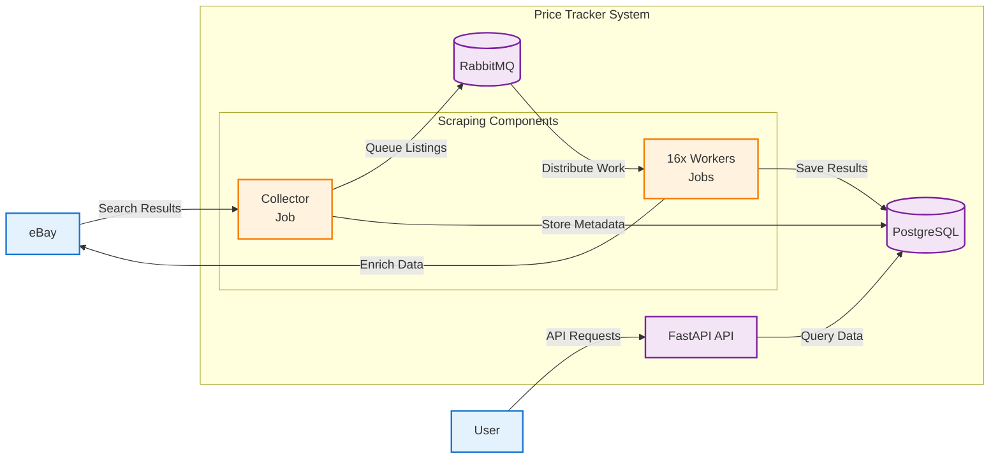
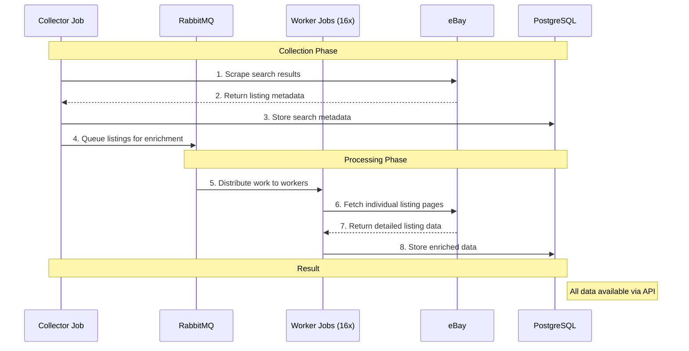
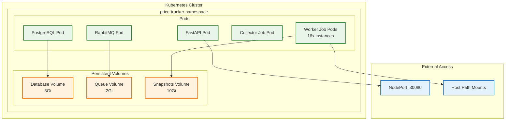

# Price Tracker Component Diagram

## Simplified Component Overview

This diagram shows the key components and their relationships in a simplified view.

## Component Responsibilities

### 🌐 **External Systems**
- **eBay**: Source of search results and listing data
- **User**: API consumers and data query users

### 🏗️ **Core Infrastructure**
- **FastAPI**: REST API for data access and queries
- **PostgreSQL**: Primary data storage for all collected information
- **RabbitMQ**: Message queue for work distribution and coordination

### 🔄 **Scraping Components**
- **Collector Job**: Scrapes search results and initiates processing pipeline
- **Worker Jobs**: 16 parallel workers that enrich individual listings

## Data Processing Pipeline

## Performance Metrics

| Component | Capacity | Performance |
|-----------|----------|-------------|
| **Collector** | 1 job | ~100 listings/minute |
| **Workers** | 16 parallel | ~16 listings/minute each |
| **Queue** | Unlimited | Message persistence + TTL |
| **Database** | Persistent | ACID transactions |
| **API** | Multiple users | RESTful queries |

## Scalability Options

### 🔧 **Horizontal Scaling**
- **Workers**: Increase `WORKER_PARALLELISM` for more concurrent processing
- **API**: Scale FastAPI deployment replicas
- **Queue**: RabbitMQ clustering for high availability

### 📈 **Vertical Scaling**
- **Resources**: Increase CPU/memory limits for all components
- **Storage**: Expand PostgreSQL and RabbitMQ storage
- **Network**: Optimize bandwidth for high-volume scraping

## Deployment Architecture

